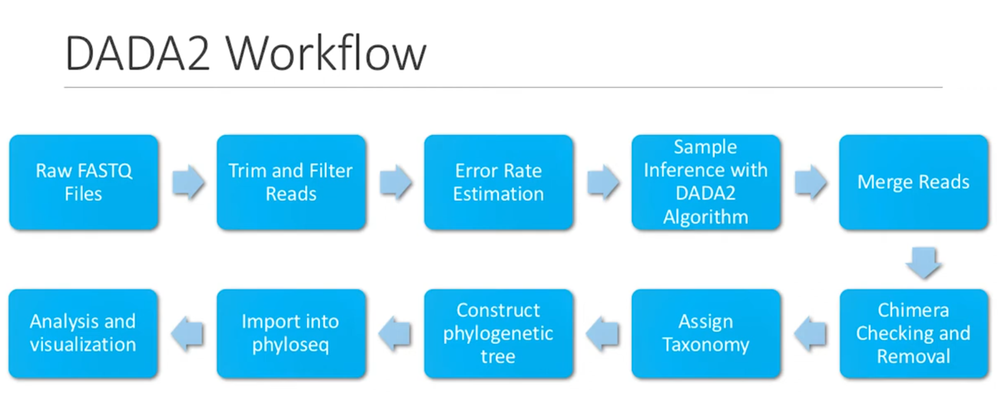
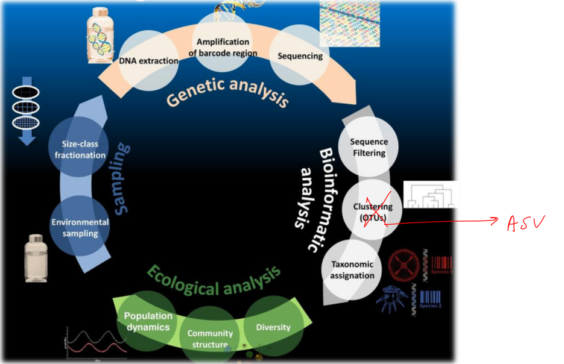

# DADA2

https://www.bioconductor.org/packages/release/bioc/vignettes/dada2/inst/doc/dada2-intro.html#overview-of-the-dada2-pipeline


# [Youtube video from Brown uni](https://www.youtube.com/watch?v=wV5_z7rR6yw)


==Full script if mistakes [here](https://compbiocore.github.io/metagenomics-workshop/assets/DADA2_tutorial.html)==


## before putting data in dada2

remove barcodes and adaptators (cutadapt or Trimmomatic)

samples should bedemultiplex into individual fastQfiles (Idemp)

put reverse and forward reads in the same order

### Check the overlap

if nearly fully overlap, you can agressivly trim the read to avoid bad sequences

## Dada2 workflow



### Load Packages

```R
library(dada2)
library(DECIPHER) # sequence alignement that will be needed to construct the phylogenic tree
library(phangorn) # to construct the phylogenic tree
library(ggplot2) # data visualization and analysis (at the end)
library(phyloseq) # data visualization and analysis (at the end)
```


### Raw FASTQ Files

```R
# Specify path where FASTQ files are located
path <- "~/DADA2_Tutorial" # change to the diretory containing the FASTQ files after unzipping
list.files(path) # list all the reads. Usually, R1 files contains the forward reads and R2 the corresponding resverse reads.

# Sort the files to ensure reverse and forward reads are in the same order
fnFs <- sort(list.files(path, pattern="_R1_001.fastq"))
fnRs <- sort(list.files(path, pattern="_R2_001.fastq"))

# Extract sample names, assuming filenames have format: SAMPLENAME_XXX.fastq
sample.names <- sapply(strsplit(fnFs, "_"), `[`, 1) # here I don't get the end of he code

# Specify the full path to the fnFs and fnRs
fnFs <- file.path(path, fnFs)
fnRs <- file.path(path, fnRs)
```


### Trim and Filter Reads

Plot the quality score and determine the trimming cut-offs (usually 30 is the lowest accepted quality score but I will makr that we only keep data with really high quality)

We don't have to check for every file (just a couple), there is usually not much variation from sample to sample.

Usually, the quality of the reverse sequence is rather bad compared to the forward, that's why we will have to trim it more. However, we have to make sure that the Forward and reverse sequences are overlapping (at the very least 20 bp for DADA2 to successfully merge sequences).

We usually remove the first 10 nucleotides with *trimleft=10* because there is a drop of quality and because it contains the primers that will be annoying for later. 

```R
# Create a new file path to store filtered and trimmed reads
filt_path <- file.path(path, "filtered") # place the filtered files in a "filtered" subdirectory

# Rename filtered files
filtFs <- file.path(filt_path, paste0(sample.names, "_F_filt.fastq.gz"))
filtRs <- file.path(filt_path, paste0(sample.names, "_R_filt.fastq.gz"))

# Quality Filtering and trimming
out <- filterAndTrim(fnFs, filtFs, fnRs, filtRs, truncLen=c(240,160), # fnFs: where F reads/filtFs: where put filtered
                    maxN=0, maxEE=c(2,2), truncQ=2, rm.phix=TRUE, # MaxN: max ambiguous base allowed/ maxErrorEstimator
                    compress=TRUE, multithread=TRUE) # keep compress if the files should be zipped

head(out)
```

==maxEE== can be lowered if the quality of the reads is good or increased if the quality is bad but the samples are preciousand you can't discard the bad ones.

==truncQ== get rid of the read containing a quality score of 2 (~63% chance of a base call being incorrect), just filter out the worst samples.

### Error Rate estimation

To start, makes the assumption you have the maximum error rate in your sample (takes your most abundant sequence and assumes that's the only true sequence and that all the others are caused by errors).

```R
# Estimate the error model for DADA2 algorithm using reverse reads
errR <- learnErrors(filtRs, multithread=TRUE)
# do the same on the reverse read and it will take more cycles because the reverse reads are worse

# Plot error rates for all possible bases transitions
plotErrors(errF, nominalQ=TRUE) # black:observed error rate, red:expected
```

In general, for the error plot, the frequency of the errors rate decrease as the quality score increase.


### Dereplicate Reads

Condense the data by collapsing together all reads that encode the same sequence so that DADA2 doesn't have to work on every single read we have to speed up and simplify the computation

```R
# Dereplicate FASTQ files to speed up computation
derepFs <- derepFastq(filtFs, verbose=TRUE)
derepRs <- derepFastq(filtRs, verbose=TRUE)

# Name the derep-class objects by the sample names
names(derepFs) <- sample.names
names(derepRs) <- sample.names
```

### Sample Inference with DADA2 Algorithm

Testing the null-hypothesis that the sequence is too abundant in the sample to be solely explained by errors in the data set.

-> low p-value sequence can be considered as real sequences that are not caused by random errors.

If the sequence has a high p-value, it won't be kept 

```R
# Apply core sequence-variant inference algorithm to reverse reads
dadaFs <- dada(derepFs, err=errR, multithread=TRUE)
dadaRs <- dada(derepRs, err=errR, multithread=TRUE)
```

==Now all the Forward and Reverse reads have been denoised== we can finally merge all the forward and reverse sequences.

### Merge Reads

We’ve inferred the sample sequences in the forward and reverse reads independently. Now it’s
time to merge those inferred sequences together, throwing out those pairs of reads that don’t match.
It will return a data frame corresponding to each successfully merged sequences.

```R
# Merge denoised reads
mergers <- mergePairs(dadaFs, derepFs, dadaRs, derepRs, verbose=TRUE) # will only merge perfectly overlapped seq so can addmaxMismatch 1 or 2 if lots of reads are not merging

# Inspect the merger data.frame from the first sample
head(mergers[[1]])


# Tabulate Denoised and Merged data
seqtab <- makeSequenceTable(mergers)
dim(seqtab)

# View the total length of al total RSVs (Ribosomal Sequence Variants) (close to an OTU table)
table(nchar(getSequences(seqtab))) # gives how sequences there is for the length of the sequence
```


### Chimera Checking and Removal

Chimera: fusion of two or more parents sequences

Perform multiple sequence alignment from the least abundant read and for all the more abundant read, it will do sequence alignment with all possible combinations. When a chimera is detected, it is removed from the sequence table.

```R
# Perform de novo chimera sequence detection and removal
seqtab.nochim <- removeBimeraDenovo(seqtab, method="consensus", multithread=TRUE, verbose=TRUE)
dim(seqtab.nochim)

# Calculate the proportion of the non-chimeric RSVs (reads)
sum(seqtab.nochim)/sum(seqtab)
```

More than 90% of the unique sequences identified are bimeras and most of the total reads shouldn't be identified as chimera (less than 70% is really bad).

If too much chimera, check if trim the 20 first base pairs of the reads because contain primers that can artificially increase the number of chimera. If not, try trimming more the low quality bp.

### Assign Taxonomy

```R
# Assign taxonomy using RDP database (greengenes and Silva also available)
# This is performed in two steps: this first one assigns phylum to genus
taxa <- assignTaxonomy(seqtab.cochim,"~DADA2_Tutorial/Taxonomy/rdp_train_set_16.fa.gz", multithread=TRUE) # database we want to use
unname(head(taxa))

# Assign species (when possible)
system.time({taxa.plus <- addSpecies(taxa, "~DADA2_Tutorial/Taxonomy/rdp_species_assignement_16.fa.gz", verbose=TRUE)
colnames(taxa.plus) <- c("Kingdom", "Phylum", "Class", "Order", "Family", "Genus", "Species")
unname(taxa.plus)}) # Usually hard to go down to species level assignment with V4 region (hypervariable region)
```

==using a reference database==

### Construct Phylogenic tree ==(Not sure if I'll need to go further)==

first need to align sequences in the sequence table

```R
# Extract sequences from DADA2 output
sequences <- getSequences(seqtab.nochim)
names(sequences) <- sequences 

#Run sequence alignment (MSA) using DECIPHER
alignment <- AlignSeqs(DNAStringsSet(sequences), anchor=NA)


# Change sequence alignment output into a phyDat structure
phang.align <- phyDat(as(alignment, "matrix"), type="DNA")

# Create a distance matrix
dm <- dist.ml(phang.align)

# Perform Neighbor joining
treeNJ <- NJ(dm)

# Internal maximum likelihood
fit = pml(treeNJ, data=phang.align)

# Negative edges length changed to 0
fitGTR <- update(fit, k=4, inv=0.2)
fitGTR <- optim.pml(fitGTR, model="GTR", optInv=TRUE, optGammma=True,
                   rearrangment = "stochastic", control = pml.control(trace=0))
```


### Import into Phylliseq

```R
map <- import_qiieme_sample_data("~DADA2_Tutorial/Tutorial_Map.txt")

ps <- pyloseq(otu_table(seqtab.nochim, taxa_are_row=False),
             tax_table(taxa.plus), phhy_tree(fitGTR$tree)) # takes taxonomic table, sequence table, tree, mapping file and put it into a usable format (associate metadata with all the samples)

# Merge PS object with map
ps <- merge_phyloseq(ps, map)
ps
```

It is possible to root the tree if you want to set the phylogenetic relationships.

### Analysis and visualization

If we want Alpha Diversity metrics

```R
plot_richness(ps, x="day", measures=c("Shanon", "Simpson)"), color="when") + theme_bw() # gives Shanon (richness) and Simpson (evenness) diversity in the community
```

There is also Beta Diversity if wanted


# Ampvis

## Loading data

```R
library(ampvis2)
d <- amp_load(
  otutable = "path/to/otutable.csv",
  metadata = "path/to/samplemetadata.xlsx",
  taxonomy = "path/to/taxonomy.csv"
)

```


## Filtering and subsetting

```R
data("MiDAS")
MiDAS

MiDAS$refseq

MiDASsubset <- amp_subset_samples(
  MiDAS,
  Plant %in% c("Aalborg West", "Aalborg East")
)

MiDASsubset <- amp_subset_samples(
  MiDAS,
  Plant %in% c("Aalborg West", "Aalborg East") & !SampleID %in% c("16SAMP-749"),
  minreads = 10000
)

MiDAS_Chloroflexi_Actinobacteria <- amp_subset_taxa(
  MiDAS,
  c("p__Chloroflexi", "p__Actinobacteria")
)
```


## Heatmap


```R
amp_heatmap(
  MiDASsubset,
  group_by = "Plant"
)
```

If wanna put more arguments

```R
amp_heatmap(MiDASsubset,
            group_by = "Plant",
            facet_by = "Year",
            tax_aggregate = "Genus",
            tax_add = "Phylum",
            tax_show = 25,
            color_vector = c("white", "darkred"),
            plot_colorscale = "sqrt",
            plot_values = FALSE) +
  theme(axis.text.x = element_text(angle = 45, size=10, vjust = 1),
        axis.text.y = element_text(size=8),
        legend.position="right")
```


# Notes from Mar

## Goal of metabarcoding

Characterization of the taxonomic diversity inhabiting various ecosystems using direct environmental DNA

We can't use the full genome, hence, we have to use 16S region (~200-400bp): a marker for bacterial and Archeal identification. But there is PCR and sequencing (Illumina) errors in the sequences.

 

Pair-end sequencing is usually better, as max read of illumina is 300bp, we obtain 2 x 300bp.

We pool all the sample together(multiplexing and add an index/barcode to the sequence so that we can then separate the samples: demultiplexing). It cost less, is faster and we can avoid as much batch effect as possible.

==Demultiplex:== using the barcodes

==Filter==: remove bad quality sequencing reads

==Cluster(OTUs):== one cluster = sequence identity > 97%. but the can be some ambiguous OTU assignement when a sequence can match in more than one OTU. And there is a centroid sequence taht is the sequence that minimize the sum of the distances to the other sequences of the cluster (commonly the most abundant one). One of the problem is taht it tends to overestimate the bidiversity and is efficient if there is not much errors, which is not the case for PCR and Illumina sequencing because we have chimera for exemple. A cut-off of 98.5% or even a bit high (98.7%) would be better and is used in bacterial identification.


 ==Taxonomic assignation:== 
