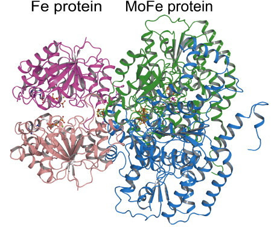
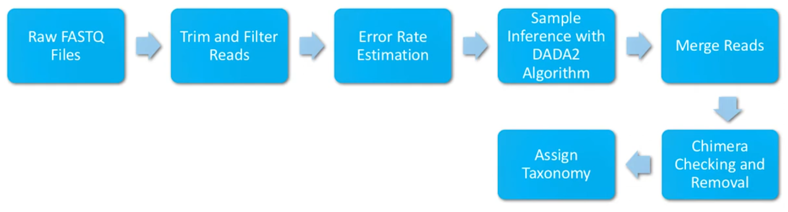

<!-- Voir -->
<!-- https://github.com/Wandmalfarbe/pandoc-latex-template/tree/v2.1.0 -->
<!-- pour les options de mise en page-->

\paragraph*{Declaration of Originality}

I, Rémi Legrand, hereby confirm that I am the sole author of the written work here enclosed and that I have compiled it in my own words. Parts excepted are corrections of form and content by my supervisor. All information derived from other sources has been duly acknowledged in the references, and due credit is given to the parties involved. No part of this work was previously presented for any other diploma at any other institution.

# Introduction

## Why study dinitrogen-fixing bacteria?

Nitrogen is a main block of life since it is present in DNA and proteins. However, Nitrogen is
limited in most of the ocean surface [@singh_contribution_2012].

Even though the N2 gas constitutes around 78% of our atmosphere and is saturated in seawater,
the di-nitrogen fixation process is to a large extent mediated by diazotrophs in the oceans [@knapp_sensitivity_2012]. Using the nitrogenase enzyme, diazotrophs break the strong triple bond between the two N atoms. This enzyme is encoded
by *nif* genes [@stacey_biological_1992].

Hence, reactive nitrogen sources such as dinitrogen (N2) fixation act as natural fertilizing
processes [@zehr_changing_2020]. Additionally, diazotrophs
have a key role in the Nitrogen cycle and is thus "linked to the fixation of atmospheric carbon
dioxide and export of carbon from the ocean's surface" [@zehr_nitrogen_2002].

Biological nitrogen fixation is catalyzed by the nitrogenase protein [@stacey_biological_1992]. It is an enzyme that reduces N2 to ammonium (NH3) and is composed of two subunits (see Figure \ref{nitrogenase}):

- the Heterotetrameric core (MoFe protein) encoded by the *nifD* and the *nifK* genes;
- the Dinitrogenase reductase (Fe protein) encoded by the *nifH* gene.




Both Nitrogenase’s subunit proteins are highly conserved but the Fe protein encoded by *nifH*
is the most highly conserved across the microbial community [@zehr_nitrogenase_2003].

## Why *nifH*?

Usually, to characterize a population, we use the 16 S subunit of the polymerase. However, in
the case of nitrogen-fixating microbial species, there are some genetic divergences of *nifH*
between the species and the “16S rRNA genes do not correlate well at sequence dissimilarity
values used commonly to define microbial species” whereas *nifH* does [@gaby_comprehensive_2014]. Hence the *nifH* gene is commonly used to characterize a population
of Nitrogen fixating bacteria.

## Goals of the internship

To characterize the studied population, a reference database containing the taxonomy and the
sequences of the *nifH* gene for different species is needed. The first *nifH* database was created in 2014 and continuously updated until 2017 by the Zehr Lab [@heller_arbitrator_2014]. It was then normalized and kept updated manually by @moyn413.

However, the current database leaves a considerable amount of unannotated sequences, and
the annotation rate increases with the taxonomic level.
The goal of my internship is to improve the current *nifH* database by using some other
databases such as NCBI [@sayers_database_2022] and to write a code for automatizing the update.

## Organization of the report

In my internship, I first reproduced the processing and annotation of the sequences of @benavides_sinking_2022 with DADA2 in order to evaluate the annotation rate of the dataset of the study. The methodology for building, collect and processing the samples is described in Section \ref{sec.metabar}, \ref{sec.amplicon}, and \ref{sec.dada2} while the outcome of my replication attempt is presented in Section \ref{sec.res.dada2}.

Then, I intended to improve the reference database of the *nifH* gene with Python using the NCBI databases. These databases and how to interacted with them are described in Section \ref{sec.ncbi} and \ref{sec.entrez} while the explanations of what I did are presented in Section \ref{sec.res.python}.

<!-- First step: -->
<!-- - reproduire les résultats précédents. -->
<!--    - méthode = metabarcoding -->
<!--    - obtenir les échantillons = dataset -->
<!--    - dernière étape = processing, i.e., dada2 -->

<!-- - recalculer la BD de ref avec NCBI -->
<!--   - NCBI -->
<!--   - Manière d'interagir -->
<!--   - formats de fichiers communs -->
<!--   -  -->


# Methods

## Collecting environmental data: Metabarcoding
\label{sec.metabar}
Metabarcoding is a popular approach to characterize the taxonomic diversity of a population using
environmental DNA. In our case, we will use the *nifH* gene even though the process is generic.

The metabarcoding approach can be divided into the following steps:

1. Sample the environment we are interested in, in this case, it is ocean or seawater;
2. Extract the DNA and amplify using Polymerization Chain Reaction (PCR) of the region we are interested in using the appropriate primers [@angel_evaluation_2018];
3. Sequence the data using high-throughput sequencing (like Illumina sequencing);
4. Process the samples through an adequate pipeline that matches them with a reference database to obtain the annotation of the sequences.

Although the first step typically involves costly field expedition, the second and third ones are generally conducted by private companies. The last step is conducted by the researchers themselves. 

## *nifH* amplicon datasets used
\label{sec.amplicon}

In the lab I had access to datasets obtained from two different expeditions:

1. The **DUPE** dataset [@benavides_sinking_2022] has been created by sequencing samples coming from sediment traps at 170, 270, and 1000 m at two locations in the South Pacific. It is constituted of 12 samples.

2. The **TONGA** dataset [@filella_contrasting_2022] has been created by sampling in the ocean at two stations: in the Tonga trench volcanic arc region and the South Pacific Gyr. It is constituted of 20 samples.

During my internship, I focused on the **DUPE** dataset as it was complete.

## Overview of the DADA2 Workflow
\label{sec.dada2}

DADA2 [@callahan_dada2_2016] is a pipeline
used to clean and annotate the genomic data coming from a population which can run on a laptop using R (see @cabral_microbiomemetagenome_2017 for more details). The workflow illustrated in Figure \ref{dada2} is a generic one and an example can be found in the
appendix (see Section \ref{sec.appendix.dada2}).



The next subsections describe every stage of the pipeline.

### Raw FASTQ Files

The **FASTQ** format is a text file format used to store at the same time the biological sequences and the associated quality score. It is the standard output given by high-throughput sequencers. The first stage is thus to import the Raw FASTQ files. In most cases, paired-end sequencing is used so the reads should be associated pairwise.

### Trim and Filter Reads

Then using the plot of the quality score the analyst determines the trimming cut-offs (usually the lowest accepted quality score is 30), making sure that for each pair the forward and reverse
sequences overlap by at least 20bp (base pairs) to enable DADA2 to successfully merge the two sequences.

This step helps to remove the sequencing errors and artifacts and to keep only high-quality
sequences.

### Error Rate Estimation

DADA2 builds an error model by learning the sequencing errors from the quality-filtered
reads. The error model is then used to correct errors in the reads, improving the sequence
accuracy.

In general, for the error plot, the frequency of the errors rate decrease as the quality score
increase.

Then the analyst should check that the Error Frequency observed in the data fits the Expected
Error rate predicted by the Q-score.


The graph in Figure \ref{error_rate} represents the frequency of all possible base transitions in the **DUPE** dataset. The black line is what we observe in the data, and the red line is what we expect from the Q score. 

### Dereplicate Reads

Condense the data by collapsing together all read encoding for the same sequence to reduce
redundancy. It will speed up and simplify the computation.

### Sample Inference with DADA2 Algorithm
Test the null hypothesis that the sequence is too abundant in the sample to be solely explained
by errors in the data set. Hence, a low p-value sequence can be considered as a real sequence
that is not caused by random errors, and on the contrary, if the sequence has a high p-value it
would likely be caused by errors and won't be kept.
It is the last denoising step for the Reverse and forward reads.

### Merge Reads

Once the sample sequences in the forward and reverse reads have been inferred independently, 
it is time to merge them, throwing out the pairs of reads that do not
match. It will return a data frame corresponding to each successfully merged sequence.

### Chimera Checking and Removal

A chimera is a fusion of two or more parent sequences and can be created during the PCR
amplification process. To spot the chimera sequences, the pipeline performs multiple sequence
alignments from the least abundant read, and for all the more abundant reads, it will do
sequence alignment with all possible combinations. When a chimera is detected, it is
removed from the sequence table.

In general, more than 90% of the unique sequences identified are bimeras and most of the total reads shouldn't be identified as chimeras.

If there are too many chimeras, the analyst should check if the 20 first base pairs of the reads have been trimmed. Indeed, they contain primers that can artificially increase the number of chimeras. Otherwise, the analyst should try to trim more of the low-quality base pairs.

### Assign Taxonomy

This is the part I have been working on. The analyst should provide as an input a reference database in the FASTA format. The **FASTA** format is a text file used to store biological sequences (nucleic or proteic) and is a standard file used in informatics. The first line starts with ">" followed by a description of the sequence (i.e., Domain / Phylum / Class / Order / Family / Genus in our case), and the second line is the corresponding DNA or amino acids sequence (i.e., DNA sequences of the *nifH* gene in our case). 

Then DADA2 will infer the taxonomy and build the annotation based on the sequence similarity.

## NCBI Databases
\label{sec.ncbi}

The National Center of Biotechnology Information (NCBI [@sayers_database_2022]), is an American institute developing software to analyze genome data. NCBI is not itself a database but it aggregates
many databases such as GenBank, RefSeq, and PubMed which are the most famous ones.
Here I will only present the main ones that are relevant for our study.

The **gene** database integrates information from a wide range of species. A record may include
nomenclature, Reference Sequences (RefSeqs), maps, pathways, variations, phenotypes, and
links to the genome, phenotype, and locus-specific resources worldwide.

The **proteins** database is a collection of sequences from several sources, including
translations from annotated coding regions in GenBank, RefSeq, and TPA, as well as records
from SwissProt, PIR, PRF, and PDB. Protein sequences are the fundamental determinants of
biological structure and function.

It is really interesting in our case because the *nifH* gene is coding for a protein and hence we
can access the taxonomy and many other interesting information on different databases. The
downside is that we obtain the amino acid sequences and not the DNA ones and there are possibly many duplicates.

The **Identical Protein Groups (IPG)** database takes in my opinion the best of both worlds:
we obtain all the sequences clustered when Amino Acids sequences are identical, we can
obtain the ID of the corresponding DNA sequences and it gathers the information from
different databases such as Swissprot, GenBank, PIR, etc.

## Accessing the NCBI library from Python through *Entrez*
\label{sec.entrez}

*Entrez*, Global Query Cross-Database Search System, [@entrez] is a searching tool provided by NCBI enabling one to browse through the information of over 20 databases such as Swiss-Prot, PRF, and PIR-International.

It is an indexing and retrieving system gathering data from various sources and handing it
back in a uniform format such as FlatFile, Fasta, or XML. Thanks to it, it is possible to
retrieve information without going through the NCBI website, which makes it easier to
automatize when working on large datasets like the one we want to build.

We used the Extensible Markable Language (**XML**) format, which is a markup language and a file format for storing. It is made to be readable by both humans and machines and it structures the information. In the case of NCBI, it is used to gather all the concerning a sequence, such as the sequences, the authors, the paper it has been published in, the sequence, the taxonomy, etc. in the same file.

# Results


I first rewrote the DADA2 pipeline to obtain the annotation rates for depending on the taxonomic rank on the DUPE database [@benavides_sinking_2022]. I used @cabral_microbiomemetagenome_2017 as a support in R (section \ref{sec.res.dada2}).


I then intended to improve the reference file using Python scripts that I fully developed myself. To do so I explored four different avenues of research that did not lead to a satisfying result and I will present the main ones in the section \ref{sec.res.python}.

<!-- All the codes in this section are fully developed by myself in python. -->

<!-- I then extracted the un-annotated sequences with python and blast it with NCBI to add it in the reference file with R before realizing the problems that it implied. -->

<!-- I then tried to gather the DNA sequences coming from the gene database of NCBI using Python. However the DNA sequences are at the IUPAC format, meaning that it does not only contain ATCG but also R,Y,S,W,K,M, etc for the ambiguous base pairs which provides more information but DADA2 is not able to use such a reference file. -->

<!-- I then tried to obtain the corresponding DNA files for all the IPG reports corresponding to the *nifH* gene. However I thought that only on DNA file for each IPG report was enough as the RNA sequence was the same, but of course after talking with NCBI I realized my mistake that the corresponding DNA files are often different after the reply from NCBI and hence we need to download all the DNA files.-->

## Running DADA2 on the dataset

\label{sec.res.dada2}


In order to check the annotation rate of the annotation rate produced by current reference file, I ran the DADA2 pipeline for the DUPE dataset (see Section \ref{sec.appendix.dada2}). Here we have the annotation rate of the already processed sequences meaning that the low quality reads and chimeras have already been removed. In the figure \ref{annotation_rate}, we can see that the annotation rate is decreasing along the Taxonomic rank. The annotation rate is high at the Kingdom level (89.6%), however, it quickly drop to 24.1% for the Order level. 

\begin{figure}
\centering

\includegraphics[width = 9cm]{img/annotation_rate.png}

\caption{Annotation rate of the sequences coming from the DUPE
expedition after being processed by the DADA2 pipeline using the current
reference file\label{annotation_rate}}
\end{figure}


With this level of annotation, it can be tough to characterize the population because we need to suppose that the annotation rate of the sequences is uniformly distributed over the species, meaning that the reference database does not annotate significantly more some species than some other. Which is why in the next section I will talk about how to make a more complete reference database to obtain improve the annotation rate.

## Implementation with Python
\label{sec.res.python}

### Improving the database

\label{sec.blast.rf}

Our initial goal was to use the current reference database made by @moyn413, extract the unannotated sequences and BLAST [@altschul_basic_1990] them using NCBI in order to extract sequences with a relevant alignment and then enrich back the database with them.

However, it revealed to be a bad idea because:


1. This reference database has been manually updated and hence there is a possibility of human errors;
2. This reference database is not updated automatically. Unfortunately, the general bacteria taxonomy has recently changed [@hugenholtz_prokaryotic_2021] and the file had to be manually revised.
3. The first database has been created using ARBitrator [@heller_arbitrator_2014], and, due to the way it was created, it both contains some non-*nifH* sequences and misses some of the *nifH* sequences. Since the current reference database is based on the one created with ARBitrator, there are still the same problems.

For all these reasons, building a new database from scratch in a fully automated way seemed  more reasonable than improving and building on top of something we are not fully confident in.

### Making a new database from scratch

\label{sec.new.db}

<!-- FIXME: It is not so easy to evaluate what you have done. Explique que tu as suivi plusieurs pistes qui n'ont pas abouti pour différentes difficultés techniques et produit 5 versions de code différentes avant d'aboutir à celle qui est fournie en annexe. Explique aussi bien ce qui est vraiment de toi et ce qui est une inspiration du code de quelqu'un d'autre. -->


<!-- What I did: -->

<!-- I had different avenues of research that did not lead to a satisfying result. All the codes in this section are fully developed by myself in python. -->

<!-- I first rewrote the DADA2 pipeline using @cabral_microbiomemetagenome_2017 as a support in R. -->

<!-- I then extracted the un-annotated sequences with python and blast it with NCBI to add it in the reference file with R before realizing the problems that it implied. -->

<!-- I then tried to gather the DNA sequences coming from the gene database of NCBI using Python. However the DNA sequences are at the IUPAC format, meaning that it does not only contain ATCG but also R,Y,S,W,K,M, etc for the ambiguous base pairs which provides more information but DADA2 is not able to use such a reference file. -->

<!-- I then tried to obtain the corresponding DNA files for all the IPG reports corresponding to the *nifH* gene. However I thought that only on DNA file for each IPG report was enough as the RNA sequence was the same, but of course after talking with NCBI I realized my mistake that the corresponding DNA files are often different after the reply from NCBI and hence we need to download all the DNA files. -->


My goal was to create a program that gathers the sequences and the taxonomy from NCBI (and
in the future maybe also from other databases) for all the records available of the DNA
sequences of the *nifH* gene. For scalability reasons, I chose to make a program that fetches only the annotated *nifH* sequences in NCBI.

To do so I used the *Identical Protein Groups*. For a given QUERY, we obtain one report for
each identical amino acids sequence, and inside of each report there is the reference of the
DNA file, the database it is present in, Start and Stop (most of the time this DNA sequence is
part of a bigger DNA sequence) and the strand.

However, *Entrez* does not enable to download the DNA sequences of the IPG reports coming
from the IPG database. Hence to obtain the DNA sequences, we need to extract the
information from the IPG report and then make a request for the DNA sequence in the gene
database.

Thus, from the information contained in the IPG reports, we can download each DNA
sequence with the corresponding taxonomy and make a reference file out of it.
Unfortunately, I obtained inconsistencies in some reports with sequences of tens of thousand
bp long whereas the *nifH* gene is around 900 bp long. I contacted the NCBI support team who gave me some leads: non identical DNA sequences may be present inside the same IPG report, and all reports should thus be downloaded to be included in the reference database .

Although I did not have the time to update my Python code (see Section \ref{sec.appendix.python}) after their reply, here is how we should proceed:

1. Gather all the IDs of the IPG reports from a Query request
2. Download the corresponding IPG report
3. Extract all references for the DNA sequences of the IPG report coming from NCBI and fill a table with it.
4. Fetch with *Entrez* the XML report for each sequence in the previous table
   - Different formats can be obtained but the most practical one is XML because it contains the taxonomy and the sequence in the same file. Moreover, it has a structure making it easy to access specific data inside the file.
   - As most of the DNA sequences the IPG report is redirecting to are genomes or groups of genes, the DNA sequence, as well as the DNA strand, the starting and stopping nucleotides have to be given.
5. Make a FASTA file by extracting for each file the taxa and the sequence.
6. Normalize the taxonomy
   - Some of the bacteria in the reference have sub-classes that are making the
   taxonomy non-uniform and should be suppressed with regular expressions.

# Discussion and conclusions

Improving the current reference database by adding the relevant sequences obtained by doing a BLAST of the un-annotated sequences over the NCBI databases revealed to be a bad idea for the reasons explained in \ref{sec.blast.rf}. 

It seemed more reasonable to create a new reference file from scratch following the steps in section \ref{sec.new.db}, although I did not have the time to fully implement it. Some minor modifications to the Python code (available in \ref{sec.appendix.python}) are still required to automatically build the *nifH* reference database from the databases available on NCBI. It will however only contain the sequences present inside the NCBI databases. The other databases such as UK-Prot and Swiss-Prot do not have the same API as NCBI and will require further developments to retrieve the data and then merge the reference databases obtained. 

It is unfortunately too soon to predict by how much the annotation rate of the new database would increase.

\bibliography{biblio.bib}\def\bibliography{}

<!-- # Old references to convert in bibtex -->
<!-- - Hallstrøm, S., Benavides, M., Salamon, E.R. *et al.* Activity and distribution of diazotrophic communities across the Cape Verde Frontal Zone in the Northeast Atlantic Ocean. *Biogeochemistry* **160**, 49–67 (2022). https://doi.org/10.1007/s10533-022-00940-w -->
<!-- - Hallstrom S., Benavides Mar, Salamon E. R., Evans C. W., Potts L. J., Granger J., Tobias C. R.,  Moisander P. H., Riemann L.  (2022).     Pelagic N-2 fixation dominated  by sediment diazotrophic communities in a shallow temperate estuary.          *Limnology and Oceanography*,    67 (2),    364-378.      ISSN 0024-3590. -->
<!-- - **Quantification of gene copy numbers is valuable in marine microbial ecology: A comment to Meiler et al. (2022)** -->
<!-- - *"Microbiome/ Metagenome Analysis Workshop: DADA2"* by Damien Cabral : https://www.youtube.com/watch?v=wV5_z7rR6yw -->


****

\clearpage\appendix

# Appendix

## DADA2 Pipeline
\label{sec.appendix.dada2}

Load DADA2

```R
library(dada2); packageVersion("dada2")
```

Raw FASTQ files

```R
# Specify path where FASTQ files are located
path <- "../data/dupe_train" # change to the directory where the FASTQ files are located after unzipping

# Sort the files to ensure reverse and forward reads are in the same order
fnFs <- sort(list.files(path, pattern="_R1_001.fastq"))
fnRs <- sort(list.files(path, pattern="_R2_001.fastq"))

# Extract sample names, assuming filenames have format: SAMPLENAME_XXX.fastq
sample.names <- sapply(strsplit(fnFs, "_"), `[`, 1) # here I don't get the end of the code but it retrieve the name of the samples

# Specify the full path to the fnFs and fnRs
fnFs <- file.path(path, fnFs)
fnRs <- file.path(path, fnRs)
```

Trim the reads

```R
# Plot average quality score
plotQualityProfile(fnFs[1:2])# I don't know what is negative but the curve is weird
plotQualityProfile(fnRs[1:6])


# Create a new file path to store filtered and trimmed reads
filt_path <- file.path(path, "filtered") # place the filtered files in a "filtered" subdirectory

# Rename filtered files
filtFs <- file.path(filt_path, paste0(sample.names, "_F_filt.fastq.gz"))
filtRs <- file.path(filt_path, paste0(sample.names, "_R_filt.fastq.gz"))
```

```R
# Quality Filtering and trimming
out <- filterAndTrim(fnFs, filtFs, fnRs, filtRs, truncLen=c(250,250),
              maxN=0, maxEE=c(2,2), truncQ=2, rm.phix=TRUE,
              compress=TRUE, multithread=TRUE)

head(out)
```

Error rate estimation

```R
# Estimate the error model for DADA2 algorithm using reverse reads
errF <- learnErrors(filtFs, multithread=TRUE)
# do the same on the reverse read and it will take more cycles because the reverse reads are worse
errR <- learnErrors(filtRs, multithread=TRUE)

# Plot error rates for all possible bases transitions
plotErrors(errF, nominalQ=TRUE) # black:observed error rate, red:expected
plotErrors(errR, nominalQ=TRUE) # black:observed error rate, red:expected
```

Dereplicate the reads

```R
# Dereplicate FASTQ files to speed up computation
derepFs <- derepFastq(filtFs, verbose=TRUE)
derepRs <- derepFastq(filtRs, verbose=TRUE)

# Name the derep-class objects by the sample names
names(derepFs) <- sample.names
names(derepRs) <- sample.names
```

Sample inference using the DADA2 algorithm

```R
# Apply core sequence-variant inference algorithm to reverse reads
dadaFs <- dada(derepFs, err=errR, multithread=TRUE)
dadaRs <- dada(derepRs, err=errR, multithread=TRUE)
```

Merge reads

```R
# Merge denoised reads
mergers <- mergePairs(dadaFs, derepFs, dadaRs, derepRs, verbose=TRUE) # will only merge perfectly overlapped seq so can addmaxMismatch 1 or 2 if lots of reads are not merging

# Inspect the merger data.frame from the first sample
head(mergers[[1]])

seqtab <- makeSequenceTable(mergers)
dim(seqtab)

table(nchar(getSequences(seqtab)))
```

Chimera checking and removal

```R
# Perform de novo chimera sequence detection and removal
seqtab.nochim <- removeBimeraDenovo(seqtab, method="consensus", multithread=TRUE, verbose=TRUE)
dim(seqtab.nochim)


# Calculate the proportion of the non-chimeric RSVs (reads)
sum(seqtab.nochim)/sum(seqtab)
```

Assign taxonomy

```R
# Assign taxonomy using RDP database (greengenes and Silva also available)
# This is performed in two steps: this first one assigns phylum to genus
taxa <- assignTaxonomy(seqtab.nochim,"../data/nifH_dada2_phylum_v1.1.0.fasta", multithread=TRUE) # database we want to use
unname(head(taxa))

class(taxa)

write.table(taxa, '../data/taxa.txt') # To save the table
```

\newpage

## Implementation with Python
\label{sec.appendix.python}

Import packages

```python
# Import packages
from Bio import Entrez
from Bio import SeqIO


# Set email adress
Entrez.email = "remi.legrand38@gmail.com.com"
```

Gather ID of the IPG report from a QUERY

```python
# Function to search data on NCBI
def search_id(query, number_seq):
    handle = Entrez.esearch(db="ipg", term=query,
                            retmax=number_seq)  # number of sequences
    record = Entrez.read(handle)
    handle.close()
    return record["IdList"]
```

```python
# Create a list containing the ID
query = "((nifH[Gene Name]) AND 100:350[Sequence Length]) NOT uncultured"
seq_id = search_id(query, 20000)
print(seq_id)
len(seq_id)
```

Download the IPG reports

```python
def ipg_report(ipg_accession):
    # Use the efetch function to retrieve the IPG record in XML format
    handle = Entrez.efetch(db="ipg", id=ipg_accession,
                           rettype="ipg", retmode="text")
    ipg_record = handle.read()

    # Save the IPG record to a file
    filename = f"ipg_report/ipg_{ipg_accession}.txt"
    with open(filename, "wb") as file:
        file.write(ipg_record)

    print(f"IPG record saved to '{filename}'")
```

```python
for id in seq_id:
    ipg_report(id)
```

Extract the first line of the IPG report present in NCBI and put it in a panda data frame

```python
import pandas as pd
import numpy as np


gene_list = pd.DataFrame(columns=["accession", "start", "stop", "strand"])

for name in seq_id:
    file = "ipg_report/ipg_"+name+".txt"
    ipg = pd.read_csv(file, sep="\t")

    insdc = np.array(ipg.loc[:, "Source"] == "INSDC", dtype="bool")
    refseq = np.array(ipg.loc[:, "Source"] == "RefSeq", dtype="bool")

    in_ncbi = ipg.loc[refseq | insdc, :]
    in_ncbi = in_ncbi.reset_index()
    url = str()
    if len(in_ncbi) != 0:
        name = str(in_ncbi.loc[0, "Nucleotide Accession"])
        start = str(in_ncbi.loc[0, "Start"])
        stop = str(in_ncbi.loc[0, "Stop"])
        if str(in_ncbi.loc[0, "Strand"]) == "+":
            strand = "1"
        elif str(in_ncbi.loc[0, "Strand"]) == "-":
            strand = "2"
        gene_list.loc[len(gene_list)] = [name, start, stop, strand]
    else:
        print(file+" is not in NCBI")

gene_list
```

Fetch with Entrez the INSDSeq XML report for each line the the previous table and download it

```python
from Bio import Entrez

Entrez.email = "remi.legrand38@gmail.com.com"


def download_insdseq_xml(index):
    accession = gene_list.loc[index, "accession"]
    start = gene_list.loc[index, "start"]
    stop = gene_list.loc[index, "stop"]
    strand = gene_list.loc[index, "strand"]
    handle = Entrez.efetch(db='nucleotide', id=accession, rettype='gb',
                           retmode='xml', seq_start=start, seq_stop=stop, strand=strand)
    # Save the XML data to a file
    with open(f'insdseq_xml_report/{accession}_INSDSeq.xml', 'wb') as file:
        file.write(handle.read())

    print('INSDSeq XML report downloaded successfully.')


for i in range(len(gene_list)):
    download_insdseq_xml(i)
```

Make a FASTA file by extracting for each file the taxa and the sequence

```python
import os
import xml.etree.ElementTree as ET

files = os.listdir('insdseq_xml_report')

with open('reference_db_ipg.fasta', 'w') as file:
    for xml_file in files:
        path = 'insdseq_xml_report/' + xml_file
        tree = ET.parse(path)
        root = tree.getroot()
        try:
            tax = root.find("./GBSeq/GBSeq_taxonomy").text
            seq = root.find("./GBSeq/GBSeq_sequence").text
        except AttributeError:
            print("in", path, "sequence or taxonomy not found")
        file.write(">" + tax + "\n")
        file.write(seq + "\n")
```

